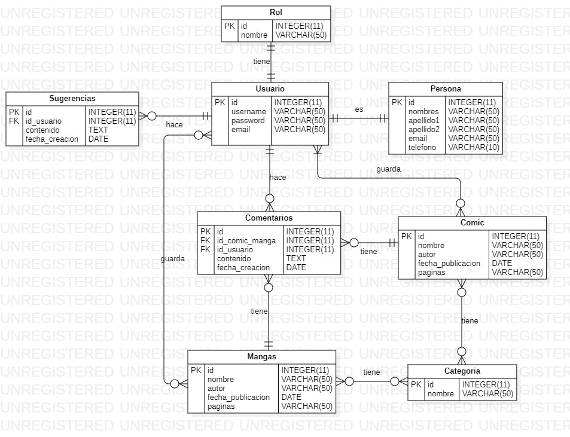
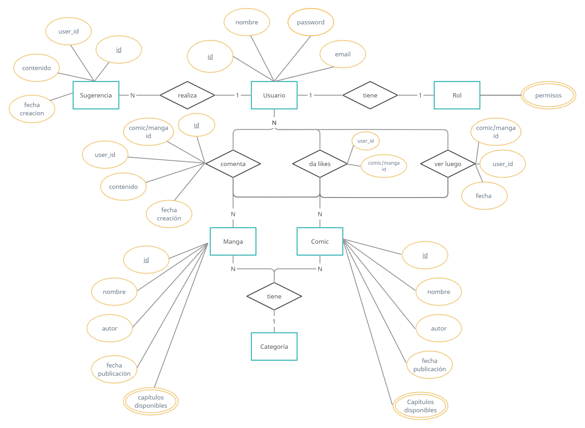

# Documento de arquitectura de software

Proyecto basado en la búsqueda de mangos y comics dentro de un repositorio en la nube.

## Nombre del software

MANICS-REST-API V1.0.0

## Autores

- Emmanuel Isaí Chablé Collí
- Ricardo Nicolás Canul Ibarra
- Iowa Alejandro Olivera Pérez

# Introducción

## Propósito

Ante la problemática de que muchas personas no pueden conseguir un comic o manga de manera física por distintos motivos (poder adquisitivo, inexistencias de puntos de venta, pérdida de tiempo en la compra, etc...) que impiden el acceso a las historias que los comics/mangas nos regalan.

## Alcance

Lo que se propone es que los usuarios desde una conexión a internet puedan acceder a un amplio catálogo de comics y mangas, siendo capaces de localizar alguno de sus productos favoritos, mediante la búsqueda de texto o imagen.

## Documentos de referencia

1. http://www.idglat.com/afiliacion/whitepapers/453167_API%20Strategy%20and%20Architecture%20A%20Coordinated%20Approach-LAS.pdf?tk=/:

2. https://juanda.gitbooks.io/webapps/content/api/arquitectura-api-rest.html

---

# Arquitectura

## Descripción de la arquitectura utilizada (Capas)

Para realizar este proyecto, se decidió utilizar una arquitectura por capas de forma que sea posible configurar cada capa de manera independiente sin que el funcionamiento de una tenga consecuencias en otra facilitando así la conexión entre ellas. Las capas en la que se dividirá el proyecto son las siguientes:

1. **Capa de seguridad**: Debido a que nuestra API contará con información sensible de los usuarios registrados será necesario contar con una capa de seguridad sólida en la cual se detendrán las posibles peticiones malintencionadas o sin autorización.

2. **Capa REST**: Manejar todas las peticiones HTTP que se efectuen hacia nuestra RESTFul API.

3. **Capa de negocio**: Contendrá toda la lógica del negocio (Casos de uso, entidades, etc...).

4. **Capa de persistencia de datos**: Encargada de obtener y almacenar datos en la base de datos de acuerdo a las solicitudes que le lleguen desde las reglas del negocio.

5. **Capa de almacenamiento en caché**: Con el fin de mantener una sensación de fluidez en la plataforma, será necesario contar con una capa de caché que sea capaz de almacenar y devolver los resultados de algunas de las peticiones más comunes con el fin de reducir la carga a la base de datos y obtener mejores tiempos de respuesta.

## Diagrama de arquitectura con descripción


> El efoque está en aislar en la medida de lo posible las reglas del negocio. Se trata de que las reglas del negocio tengan una comunicación completamente indirecta (por medio de interfaces) con todos los agentes externos.

**Componente de seguridad**: Principalmente constará de 2 funciones principales.

- **Autenticación**: Realizar todos los procesos necesarios para validar las credenciales de un usuario, con el fin de confirmar si se trata de quien se dice ser.

- **Autorización**: Asegurar que los usuarios autenticados únicamente tengan acceso a los recursos y acciones que tienen permitido.

**Componente REST**: Contiene la implementación de la RESTFul API para hacer uso de los servicios de la aplicación.

**Reglas del negocio**: Compuesto de los siguientes componentes:

- **Casos de uso**: _Frontera_ entre el exterior del sistema y las entidades que conforman todas la reglas del negocio. Contiene toda la lógica para operar y modificar el estado de las entidades.

- **Entidades**: Objetos que contienen todos los datos y la lógica en sí de todos las reglas del negocio.

- **Interfaces de comunicación**: Definen la separación entre nuestras reglas del negocio y paquetes de software de terceros.

**Implementación de los repositorios**: Todo el código relacionado a JPA (Anotaciones, Repositorios, Configuraciones, etc...).

**Sistema de Caché**: Menejo de la caché dentro del sistema.

**Elasticsearch**: Búsquedas de información.

## Diagrama de secuencia para los procesos más imporantes de la App (CRUD)

Lorem Ipsum is simply dummy text of the printing and typesetting industry. Lorem Ipsum has been the industry's standard dummy text ever since the 1500s, when an unknown

## Diagrama de la base de datos



## Descripción de las entidades

Lorem Ipsum is simply dummy text of the printing and typesetting industry. Lorem Ipsum has been the industry's standard dummy text ever since the 1500s, when an unknown

## Diagrama ER



---

# Documentación de la API

## Documentación individual de cada Endpoint por cada entidad

### Búsqueda de información

---

### `GET` - Buscar comic/manga por texto

    https://manicsrestapi/v1/search

### Descripción

Se encarga de realizar una búsqueda mediante texto.

### Campos requeridos

```JSON
{
    "response": 1232
}
```

### Validaciones

```JAVA
    @NotNull;
```

### Tipo de dato de cada campo

```JAVA
    int val;
```

### Respuesta (Response)

```JSON
{
    "response": 1232
}
```

### Ejemplos del Request

    https://manicsrestapi/v1/search/mangas?q=Berserk

```JSON
{
    "status": "on-air"
}
```

### Usuarios

---

#### `GET` - Obtener usuarios

    https://manicsrestapi/v1/usuarios

##### Descripción

Devuelve todos los usuarios registrados.

##### Respuesta

```JSON
[
    {
        "id": Integer,
        "username": String,
        "email": String
    },
    {
        "id": Integer,
        "username": String,
        "email": String
    }, ...
]
```

#### `GET` - Obtener usuario por ID

    https://manicsrestapi/v1/usuarios/{id}

##### Descripción

Devuelve el usuario con el ID ingresado.

##### Respuesta

```JSON
{
    "id": Integer,
    "username": String,
    "email": String
}
```

#### `POST` - Crear usuario

    https://manicsrestapi/v1/usuarios

##### Descripción

Crea un nuevo usuario.

##### Campos requeridos

```JSON
{
    "username": String,
    "password": String,
    "email": String
}
```

##### Respuesta

```JSON
{
    "id": Integer,
    "username": String,
    "email": String
}
```

#### `PUT` - Editar usuario

    https://manicsrestapi/v1/usuarios/{id}

##### Descripción

Actualiza la información de un usuario existente.

##### Campos requeridos

```JSON
{
    "id": Integer,
    "username": String,
    "password": String,
    "email": String
}
```

##### Respuesta

```JSON
{
    "id": Integer,
    "username": String,
    "email": String
}
```

#### `DELETE` - Eliminar usuario

    https://manicsrestapi/v1/usuarios/{id}

##### Descripción

Elimina el usuario del id dado.

##### Respuesta

Esta petición no devuelve una respuesta.

### Comics

---

#### `GET` - Obtener comics

    https://manicsrestapi/v1/comics

##### Descripción

Devuelve todos los comics registrados.

##### Respuesta

```JSON
[
    {
        "id": Integer,
        "nombre": String,
        "autor": String,
        "fecha_publicacion": String,
        "paginas": String
    },
    {
        "id": Integer,
        "nombre": String,
        "autor": String,
        "fecha_publicacion": String,
        "paginas": String
    }, ...
]
```

#### `GET` - Obtener comic por ID

    https://manicsrestapi/v1/comics/{id}

##### Descripción

Devuelve el comic con el id ingresado.

##### Respuesta

```JSON
{
    "id": Integer,
    "nombre": String,
    "autor": String,
    "fecha_publicacion": String,
    "paginas": String
}
```

#### `POST` - Crear comic

    https://manicsrestapi/v1/comics

##### Descripción

Crea un nuevo comic.

##### Campos requeridos

```JSON
{
    "nombre": String,
    "autor": String,
    "fecha_publicacion": String,
    "paginas": String
}
```

##### Respuesta

```JSON
{
    "response": {
        "id": Integer,
        "nombre": String,
        "autor": String,
        "fecha_publicacion": String,
        "paginas": String
    }
}
```

#### `PUT` - Editar comic

    https://manicsrestapi/v1/comics/{id}

##### Descripción

Actualiza la información de un comic existente.

##### Campos requeridos

```JSON
{
    "id": Integer,
    "nombre": String,
    "autor": String,
    "fecha_publicacion": String,
    "paginas": String
}
```

##### Respuesta

```JSON
{
    "id": Integer,
    "nombre": String,
    "autor": String,
    "fecha_publicacion": String,
    "paginas": String
}
```

#### `DELETE` - Eliminar comic

    https://manicsrestapi/v1/comics/{id}

##### Descripción

Elimina el comic del ID dado.

##### Respuesta

Esta petición no devuelve una respuesta.

### Mangas

---

#### `GET` - Obtener mangas

    https://manicsrestapi/v1/mangas

##### Descripción

Devuelve todos los mangas registrados.

##### Respuesta

```JSON
[
    {
        "id": Integer,
        "nombre": String,
        "autor": String,
        "fecha_publicacion": String,
        "paginas": String

    },
    {
        "id": Integer,
        "nombre": String,
        "autor": String,
        "fecha_publicacion": String,
        "paginas": String
    }, ...
]
```

#### `GET` - Obtener manga

    https://manicsrestapi/v1/mangas/{id}

##### Descripción

Devuelve el manga con el ID ingresado.

##### Respuesta

```JSON
{
    "id": Integer,
    "nombre": String,
    "autor": String,
    "fecha_publicacion": String,
    "paginas": String
}
```

#### `POST` - Crear manga

    https://manicsrestapi/v1/mangas

##### Descripción

Crea un nuevo manga.

##### Campos requeridos

```JSON
{
    "nombre": String,
    "autor": String,
    "fecha_publicacion": String,
    "paginas": String
}
```

##### Respuesta

```JSON
{
    "id": Integer,
    "nombre": String,
    "autor": String,
    "fecha_publicacion": String,
    "paginas": String
}
```

#### `PUT` - Editar manga

    https://manicsrestapi/v1/mangas/{id}

##### Descripción

Actualiza la información de un manga existente.

##### Campos requeridos

```JSON
{
    "id": Integer,
    "nombre": String,
    "autor": String,
    "fecha_publicacion": String,
    "paginas": String
}
```

##### Respuesta

```JSON
{
    "id": Integer,
    "nombre": String,
    "autor": String,
    "fecha_publicacion": String,
    "paginas": String
}
```

#### `DELETE` - Eliminar manga

    https://manicsrestapi/v1/mangas/{id}

##### Descripción

Elimina el manga del id dado.

##### Respuesta

Esta petición no devuelve una respuesta.

### Comentarios

---

#### `GET` - Obtener comentarios

    https://manicsrestapi/v1/comentarios

##### Descripción

Devuelve todos los comentarios.

##### Respuesta

```
[
    {
        "id": Integer,
        "id_comic_manga": Integer,
        "id_usuario": Integer,
        "contenido": String,
        "fecha_creacion": String

    },
    {
        "id": Integer,
        "id_comic_manga": Integer,
        "id_usuario": Integer,
        "contenido": String,
        "fecha_creacion": String

    }, ...
]
```

#### `POST` - Crear comentario

    https://manicsrestapi/v1/comentarios

##### Descripción

Crea un nuevo comentario.

##### Campos requeridos

```JSON
{
    "id_comic_manga": Integer,
    "id_usuario": Integer,
    "contenido": String
}
```

##### Respuesta

```JSON
{
    "id": Integer,
    "id_comic_manga": Integer,
    "id_usuario": Integer,
    "contenido": String,
    "fecha_creacion": String
}
```

#### `PUT` - Editar comentario

    https://manicsrestapi/v1/comentarios/{id}

##### Descripción

Actualiza la información de un manga existente.

##### Campos requeridos

```JSON
{
    "id": Integer,
    "contenido": String
}
```

##### Respuesta

```JSON
{
    "id": Integer,
    "id_comic_manga": Integer,
    "id_usuario": Integer,
    "contenido": String,
    "fecha_creacion": String
}
```

#### `DELETE` - Eliminar comentario

    https://manicsrestapi/v1/comentarios/{id}

##### Descripción

Elimina el comentario del ID dado.

##### Respuesta

Esta petición no devuelve una respuesta.

# Criterios de calidad

Según el modelo de calidad ISO/IEC 25010 nos proponen una serie de atributos de calidad para el producto:

- Adecuación funcional
- Eficiencia de desempeño
- Compatibilidad
- Usabilidad
- Fiabilidad
- Seguridad
- Mantenibilidad
- Portabilidad

Debido a las necesidades del proyecto, el proyecto de centrará en cumplir con alguno de ellos:

1. La **seguridad** es muy importante para la gran mayoria de sistemas de hoy en día por lo que es un punto que, sin lugar a dudas, se debe de tratar. Para fines de este proyecto, se considerará las siguientes funcionalidades:

   - El servicio rest estará reestringido para dos tipos de usuarios:
     - Administrador.
     - Usuario público.
   - El administrador contará con permisos que un usuario público no tendrá acceso. La autorización se hará por medio de un _token_ que se otorgará al momento de iniciar sesión.

2. **Portabilidad**: al tratarse de un servicio REST alojado en la nube, este podrá utilizarse en cualquier dispositivo que cuente con internet, y pueda hacer uso del protocolo HTTP.

3. **Fiabilidad**: Al tratarse de un servicio basado en el protocolo HTTP, _el manejo de errores_ estará visible para el usuario mediante los códigos correctos HTTP para cada problema que se presente. Este servicio utilizará transacciones las cuales significan que ante un error del sistema este tendrá la _capacidad de recuperar_ la información afectada.

4. **Usabilidad**: Este servicio estará planeado para realizar las diferentes funcionalidades de una manera sencilla, esto debido a la utilización del formato de texto de intercambio de informacion más común dentro de la web: JSON.
